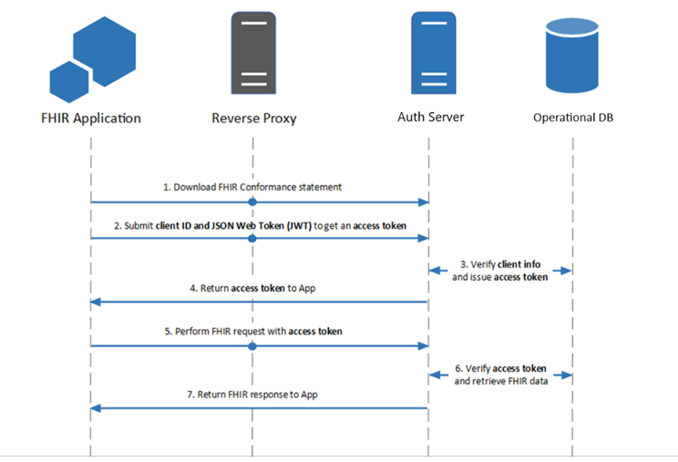

# SMART Backend Authentication in FHIR System



## Overview
SMART (Substitutable Medical Applications, Reusable Technologies) backend authentication in an **FHIR (Fast Healthcare Interoperability Resources) system** enables **system-to-system authentication** without direct user interaction. It uses **OAuth 2.0 client credentials** and **JWT-based authentication** to securely access FHIR resources.

## Key Components
1. **OAuth 2.0 with Client Credentials Grant**  
   - The backend service authenticates using **client credentials** (client ID and secret).  
   - It requests an **access token** from the FHIR authorization server.  

2. **JWT-Based Authentication**  
   - The backend client generates a **JWT (JSON Web Token)** signed with its **private key**.  
   - The JWT is used to request an **OAuth 2.0 access token**.  

3. **Scopes and Permissions**  
   - Access is controlled via **FHIR scopes**, e.g.:  
     - `system/*.read` → Read all system-wide FHIR resources.  
     - `system/Patient.read` → Read patient resources only.  

4. **Access Token Usage**  
   - Once authenticated, the backend service uses the **access token** to make **FHIR API calls**.  
   - The FHIR server verifies the token before processing the request.  

---

## **Implementation Steps**

### **Requirements**
Install the required Python dependencies:

```sh
pip install cryptography jwcrypto pyjwt
```

### **Step 1: Generate RSA Key Pair**
Run the Python script [generate_keys.py](generate_keys.py) to generate an **RSA private-public key pair**.

```sh
python generate_keys.py
```

This will generate:
- **`private_key.pem`** → The private key.
- **`public_key.pem`** → The public key.
- **`jwks.json`** → The JSON Web Key Set (JWKS) file.


### **Step 2: Use JWT for Authentication**
After generating the RSA keys, a JWT can be created and signed with the private key to request an OAuth 2.0 access token. We can use [create_jwt_and_assertion.py](create_jwt_and_assertion.py) script to generate JWT public key and JWT assertion for authentication flow.

- **JWT key** will be submitted to FHIR server to know your public key and validate your private key signed JWT assertion for authentication flow.
- **JWT Assertion** will be used in authetication flow to obtain the access token for applicable scopes.

#### Example - JWT Key and Assertion
```json
Generated JWT Key:
{
    "kty": "RSA",
    "n": "4g1mQ...",
    "e": "AQAB",
    "use": "sig",
    "alg": "RS384",
    "kid": "5f2e8a1e-9c84-4e30-a0d6-f49d2bdb38ef"
}

Generated JWT Assertion:
eyJhbGciOiJSUzM4NCIsInR5cCI6IkpXVCIsI..
```

### **Step 3: Request an OAuth 2.0 Token**
Once the JWT is signed, exchange it for an access token.

#### Example Token Request
```http
POST /token HTTP/1.1  
Host: auth.fhirserver.com  
Content-Type: application/x-www-form-urlencoded  

grant_type=client_credentials
&client_assertion_type=urn:ietf:params:oauth:client-assertion-type:jwt-bearer
&client_assertion=eyJhbGciOiJSUzM4NCIsInR5cCI6IkpXVCIsI..
&scope=system/*.read
```

### **Step 4: Use Access Token for FHIR API Calls**
Include the access token in API requests:

#### Example API Request
```http
GET /fhir/Patient HTTP/1.1
Host: fhirserver.com
Authorization: Bearer <access_token>
```

## **Conclusion**
By following the above steps, you can implement **SMART Backend Authentication** in an **FHIR** system, ensuring secure **system-to-system communication** using **JWT, OAuth 2.0, and RSA keys**.

